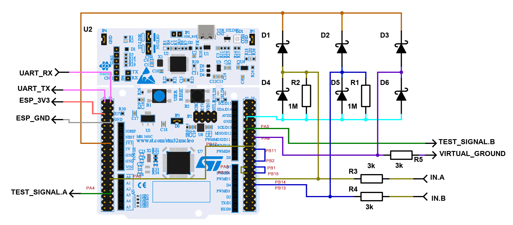

# FoxilloScope (STM32G474 Oscilloscope)

An accessible, wireless oscilloscope built around low-cost development hardware: the **ST Nucleo-G474RE** board and an **M5Stamp C3U** (ESP32-C3) module.

 - Bipolar signal measurement
 - Dual-channel
 - Up to 8 MHz sampling rate
 - 12-bit resolution
 - The user interface runs in a web browser on desktop and mobile devices
 - Communication via Wi-Fi or Bluetooth Low Energy (BLE). Bluetooth requires a compatible browser (e.g., Google Chrome).
 - No installable application required
 
The goal of this project is to turn inexpensive, readily available development components into a practical, portable oscilloscope with live-streaming over Wi-Fi or Bluetooth LE — requiring minimal soldering and no custom PCBs.

> 💡 **Developer Note**: For firmware compilation, hardware debug configurations, jumper setups, and local debug servers, see the **[Developer & Contributor Guide](DEVELOPMENT.md)**.

---

## Key Features & Hardware Design

- **Affordable Hardware**: Total hardware cost is under €25 / $30 (minimal soldering, no custom PCBs needed)
  - Analog front-end (AFE) built on the ST [Nucleo-G474RE](https://www.st.com/en/evaluation-tools/nucleo-g474re.html) board – handling signal capture and triggering
  - [M5Stamp C3U](https://www.espressif.com/en/news/M5Stamp_C3U) handles wireless connectivity and hosts the web server
  - Signal conditioning built with six Schottky diodes (BAS40-04 dual-diodes or equivalent) and five resistors
  - Inexpensive oscilloscope probes (not included in BOM)
- **Bipolar Signal Measurement**: On-chip analog front-end (AFE) supports true bipolar AC/DC signal measurements (both positive and negative voltages) around virtual ground.
  > ⚠️ **Important Grounding Notice**: Users **must not** connect probe ground clips to the board's GND pins. Always connect probe ground clips to the board's dedicated **Virtual Ground** output.
  > This provides a clean mid-rail reference for bipolar measurements and prevents shorting power rails.
- **Input Voltage Range**: Measurable range −1.65 V to +1.65 V (1:10 attenuating oscilloscope probes recommended); safe input range −30 V to +30 V.
- **Input Signal Protection**: A resistor and diode protection network protects MCU inputs against out-of-range signal spikes.
- **Multi-Transport Web UI**: Single-page web dashboard accessible via Wi-Fi (WebSockets), Bluetooth LE (WebBluetooth), or USB (WebSerial).

---

## Assemble at Home (Quick Start)

1. **Flash the Nucleo Board & Set Production Jumpers**: 
   1. Connect the Nucleo board to your computer via USB. A virtual USB drive will appear.
   2. Copy the `FoxilloScope-Production.bin` firmware file from the latest release assets directly onto the Nucleo's USB drive.
   3. Wait a couple of seconds and then disconnect the board.
   4. **Configure Jumpers (blocks onboard ST-LINK in off/reset state)**:
      - **JP1**: Closed
      - **JP5 & JP3**: Open
2. **Flash the M5Stamp C3U**:
   1. Connect the _M5Stamp C3U_ or another ESP32-C3 board to your computer via USB.
   2. Use the [Foxilloscope ESP32 Web Flasher](https://elmot.xyz/f-scope/flahser.html) to upload ESP32 part of the oscilloscope 
3. **Solder Protection & Connections**: 
   1. Prepare the signal conditioning components:
      - **Schottky Diodes**: 6× Schottky diodes (BAS40-04 dual-diode sets were used, but almost any Schottky diodes with reverse voltage $V_R \ge 40\text{ V}$ and minimal junction capacitance fit).
      - **Resistors**: $2\times 1\text{ M}\Omega$ resistors and $3\times 3\dots 6\text{ k}\Omega$ resistors.
   2. Solder the input protection network and interconnections as shown in the wiring diagram below:
      
   3. Attach measurement probes to Channel A / Channel B inputs, and connect probe ground clips to the **Virtual Ground** output. 
4. **Verify Operation**:
   1. *(Optional)* If the debug STM32 firmware is flashed, connect test signal outputs A/B to the Channel A/B inputs or probes:
      - **Test Signal A**: Small-amplitude decaying sine wave
      - **Test Signal B**: Triangle wave (−1.65 V to 0 V)
   2. **Bluetooth LE (BLE) Connection**:
      1. Power up the system and navigate to `http://f-scope.local/` in your Chrome browser.
      2. Click the Bluetooth button at the bottom-left to connect, then select the *F-SCOPE-xxxx* device.
      3. Test if oscilloscope is working correctly.
   3. **Wi-Fi Connection**:
      1. Connect to the *FoxilloScope-xxxx* Wi-Fi network.
      2. Open `http://f-scope.local/` or `http://192.168.4.1/` in your browser.
      3. Test if oscilloscope is working correctly.
5. **Wi-Fi Setup**:
   1. Connect to the *FoxilloScope-xxxx* Wi-Fi network.
   2. Open `http://f-scope.local/wifi` or `http://192.168.4.1/wifi` in your browser.
   3. Set up Wi-Fi credentials (Until ESP32-C6 gateway is used, only 2.4 GHz Wi-Fi is supported).
   4. Reconnect back to your Wi-Fi.
   5. Open `http://f-scope.local/` in your browser.

*(where xxxx represents the device ID – the last four hex digits of the ESP32 MAC address)*

---

### Printable Device Label Generator
You can generate a custom 50 mm × 90 mm label/sticker with QR codes for quick Wi-Fi pairing and web URLs:
1. Open [sticker/index.html](https://html-preview.github.io/?url=https://github.com/elmot/FoxilloScope/blob/master/sticker/index.html) in your web browser.
2. Enter the 4-digit hex MAC ID (`xxxx`) of your device.
3. Print the label to attach to your board or enclosure.

---

## M5Stamp C3U Setup & Status Indications

The M5Stamp C3U acts as the wireless bridge connecting the STM32 to your browser.

### Pin Connections
- **GPIO 6**: UART TX (connects to STM32 UART RX)
- **GPIO 7**: UART RX (connects to STM32 UART TX)
- **GPIO 2**: Data line for onboard SK6812 RGB LED (WS2812 protocol)

### Onboard RGB LED Statuses

| LED Color         | Status / Meaning                                                      |
|:------------------|:----------------------------------------------------------------------|
| **Green**         | Client actively connected over **WebSocket**                          |
| **Blue**          | Client actively connected over **Bluetooth LE (BLE)**                 |
| **Orange**        | Wi-Fi station connection failed (fallback Access Point is active)     |
| **White**         | Connected to Wi-Fi network, waiting for web client                    |
| **Purple**        | Idle in Access Point mode (`FoxilloScope` AP), waiting for connection |
| **Blinking Pink** | STM32 firmware update complete (power cycle required)                 |

---

## Deployment & Web Access

### 1. Wireless Gateway Mode (Default)
Connect your computer, phone, or tablet to the ESP32 gateway (either directly via its `FoxilloScope` AP or through your local Wi-Fi network) and open:
```text
http://f-scope.local/
```
The ESP32 serves the web frontend and streams data in real time via WebSockets.

### 2. Standalone CDN / GitHub Pages Mode
The web app can also be hosted on any static HTTPS server (e.g. GitHub Pages). In this mode, the browser connects directly to the hardware via:
- **WebBluetooth**: Connect wirelessly over BLE.
- **WebSerial**: Connect directly over USB at 460,800 baud.

---

## Documentation & References

- **[Developer & Contributor Guide](DEVELOPMENT.md)** – Firmware compilation, debug hardware jumper configurations, Python debug server, and tools used.
- **Hardware Wiring & Pinout**: [docs/pinout-peripherals.md](docs/pinout-peripherals.md) & [docs/wiring.png](docs/wiring.png)
- **Subsystem Architecture References**:
  - STM32 Firmware Architecture: [AGENTS.md](AGENTS.md)
  - ESP32 Gateway Architecture: [esp32-gateway/AGENTS.md](esp32-gateway/AGENTS.md)
  - Web Frontend Architecture: [html/AGENTS.md](html/AGENTS.md)
